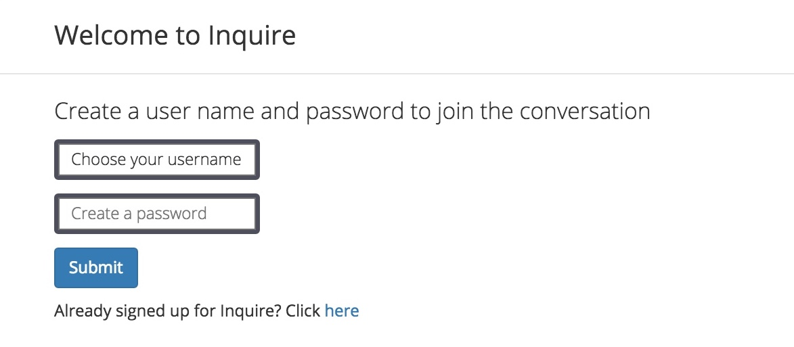
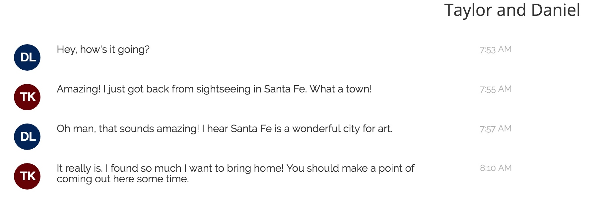

##Inquire Chat - A Slack Replica Built in Angular

_Technologies used: AngularJS, Firebase, Git, Bootstrap, others_

**About the Project**

Inquire Chat is all about conversation. Built on AngularJS and hooked up to the cloud via FireBase, this app is modular, lightweight, and easy to use. Users can create their own profiles that are authenticated through FireBase, open new chatrooms, and start conversations that can go on forever!

**From page load, users are treated to an easy and fun experience.**

The app has evolved considerably since its beginning. I was unsatisfied with a barebones chat service, and decided to integrate emojis, time filters, and CSS-driven design that makes conversations a pleasure to look at as well as engage in. Inquire Chat is currently hosted on Heroku, and can be seen [here.](https://inquire-chat.herokuapp.com)
